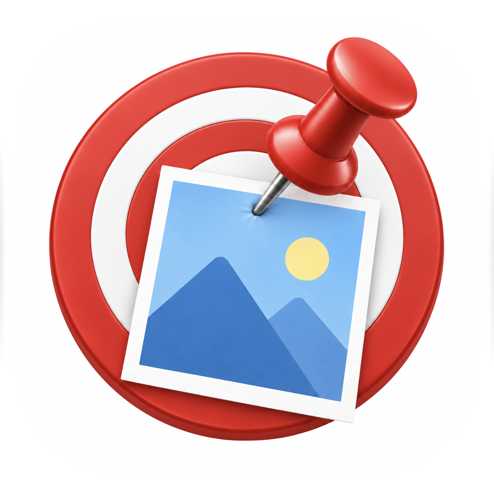

# PinShot 📌




**PinShot** is a lightweight, native macOS utility that lets you take screenshots and instantly pin them to your screen as floating, always-on-top windows. It's designed to help you keep reference materials, code snippets, or designs visible while you work.

## ✨ Features

* **Instant Screen Freeze:** The exact moment you press the shortcut, the screen freezes, allowing you to capture transient states like hover menus or tooltips.
* **Smart Window Selection:** Hover over any open window to highlight it, and simply **click** to capture the entire window perfectly.
* **Custom Region Capture:** Click and **drag** to select and capture a specific region of your screen.
* **Multi-Monitor Support:** Works seamlessly across all your connected displays.
* **Always on Top:** Pinned screenshots float above all other windows, ensuring your reference material is never hidden.
* **Quick Save Screenshot:** Press `Option + 2` to save a screenshot to `~/Pictures/PinShotCaptures` and reuse the last selected region.
* **Region Overlay Preview:** When you save with `Option + 2`, the saved area stays highlighted until you press `Esc`.
* **Pixel Magnifier:** While selecting a save region, a zoom lens shows cursor-adjacent pixels with pixel coordinates.
* **Opt+2 Macro Panel:** With `Option + 2`, a macro panel appears below the region so you can run a loop: screenshot -> after-shortcut -> post-delay -> configurable rest -> repeat.
* **Lightweight & Native:** Built purely with Swift and AppKit (No Electron, minimal resource usage).

## ⌨️ Shortcuts

| Shortcut | Action |
| --- | --- |
| `Option + 1` | Start Capture (CoreGraphics freeze capture) |
| `Option + 2` | Save screenshot to `~/Pictures/PinShotCaptures` (uses remembered region; first time asks for drag selection) |
| `Option + 3` | Set screenshot region (drag to reselect and save immediately) |
| `Cmd + Option + W` | Close all pinned screenshot windows |
| `Esc` | Cancel capture mode / hide saved-region overlay |

*(Once a screenshot is pinned, you can also hover over it to find individual close buttons or use drag to move it around).*
*You can change global shortcuts from the menu bar: `Change Capture Shortcut…` / `Change Save-Screenshot Shortcut…` / `Change Set-Region Shortcut…` / `Change Close-All Shortcut…`.*
*Use `Set Screenshot Region…` in the menu to reselect the saved region at any time.*
*Use `Play Macro` / `Stop Macro` in the Opt+2 macro panel to start or stop loop playback.*

## 🚀 Installation & Build

PinShot is built using a simple `Makefile`. No heavy Xcode project setup is required.

### Install via Homebrew

```bash
brew tap elixirevo/tap
brew install --cask pinshot
```

If you already tapped `elixirevo/tap`, this also works:

```bash
brew install --cask pinshot
```

### Prerequisites

* macOS 12.0 or later
* Xcode Command Line Tools (`xcode-select --install`)

### Build Steps

1. Clone the repository:

   ```bash
   git clone https://github.com/elixirevo/pinshot.git
   cd pinshot
   ```

2. Build the app using `make`:

   ```bash
   make
   ```

   Release build with version metadata:

   ```bash
   make release VERSION=1.0.0 BUILD=1 ARCH=arm64
   ```

   Build a universal app (`arm64 + x86_64`) and apply ad-hoc signing:

   ```bash
   make sign-adhoc VERSION=1.0.1 BUILD=1
   ```

   Build a distributable universal DMG (includes app, Applications link, and drag-to-install arrow layout):

   ```bash
   make dmg-universal VERSION=1.0.1 BUILD=1
   ```

3. The built application will be located at `build/PinShot.app`.
4. Move it to your Applications folder:

   ```bash
   mv build/PinShot.app /Applications/
   ```

## 🔒 Permissions

When you run PinShot, it checks and guides these permissions:

1. **Screen Recording:** Required to capture the screen and window contents.

*Note: PinShot works entirely offline. No data or screenshots are ever sent over the network.*

## 🛠 Contributing

Contributions are welcome! If you have ideas for new features, bug fixes, or improvements, feel free to open an issue or submit a pull request.

1. Fork the Project
2. Create your Feature Branch (`git checkout -b feature/AmazingFeature`)
3. Commit your Changes (`git commit -m 'Add some AmazingFeature'`)
4. Push to the Branch (`git push origin feature/AmazingFeature`)
5. Open a Pull Request

## 📄 License

Distributed under the MIT License. See `LICENSE` for more information.
