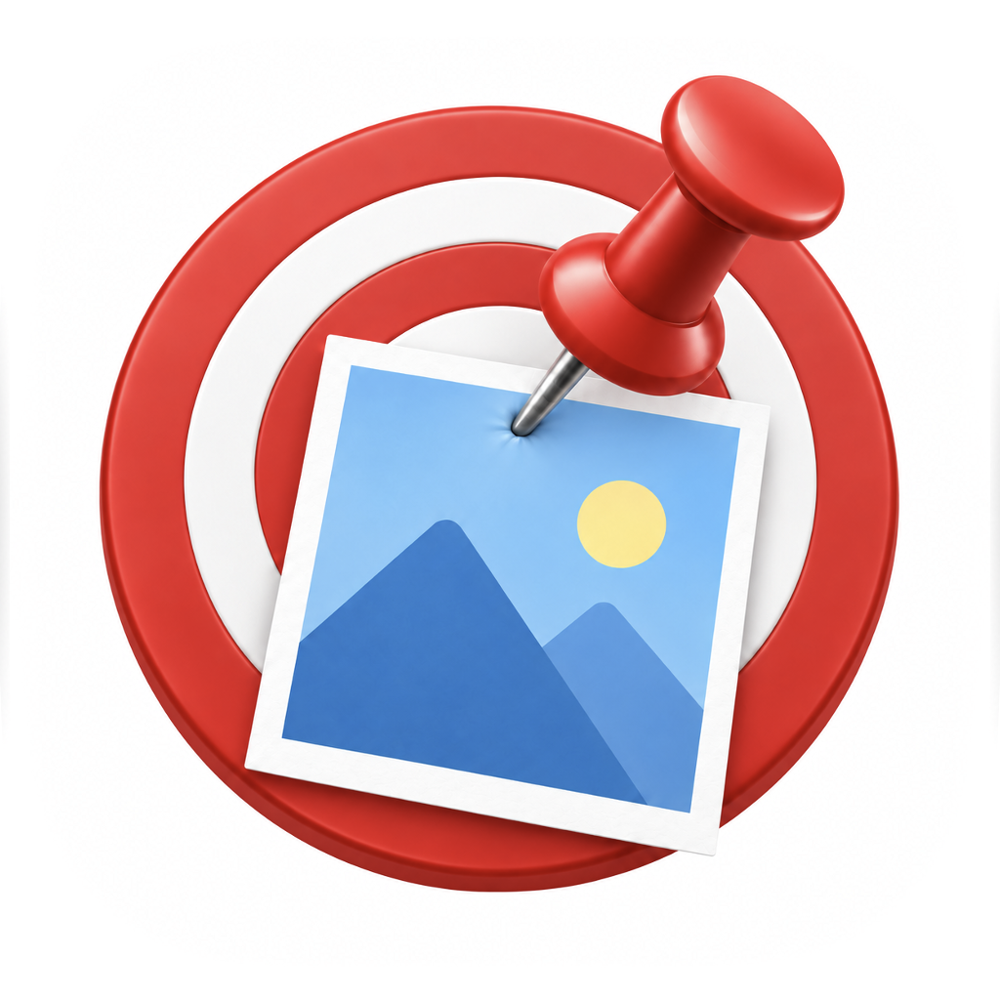

# PinShot 📌




**PinShot** is a lightweight, native macOS utility that lets you take screenshots and instantly pin them to your screen as floating, always-on-top windows. It's designed to help you keep reference materials, code snippets, or designs visible while you work.

## ✨ Features

* **Screenshot Editor (`Option + A`):** Freeze the screen, drag a region or click a window once, then annotate, copy, save, or pin the locked selection.
* **Screenshot Annotations:** Add rectangles, ellipses, arrows, freehand strokes, text, or mosaic with selectable colors and stroke widths. Undo and redo edits before exporting at the display's original pixel resolution.
* **Instant Screen Freeze:** The exact moment you press the shortcut, the screen freezes, allowing you to capture transient states like hover menus or tooltips.
* **Smart Window Selection:** Hover over any open window to highlight it, and simply **click** to capture the entire window perfectly.
* **Custom Region Capture:** Click and **drag** to select and capture a specific region of your screen.
* **Multi-Monitor Support:** Works seamlessly across all your connected displays.
* **Always on Top:** Pinned screenshots float above all other windows, ensuring your reference material is never hidden.
* **Quick Save Screenshot:** Press `Option + 2` to save a screenshot to the macro folder and reuse the last selected region.
* **Region Overlay Preview:** When you save with `Option + 2`, the saved area stays highlighted until you press `Esc`.
* **Pixel Magnifier:** While selecting a save region, a zoom lens shows cursor-adjacent pixels with pixel coordinates.
* **Opt+2 Macro Panel:** With `Option + 2`, a macro panel appears below the region so you can run a loop: screenshot -> after-shortcut -> post-delay -> configurable rest -> optional periodic shortcut -> repeat.
* **Lightweight & Native:** Built purely with Swift and AppKit (No Electron, minimal resource usage).
* **Settings Window:** Manage launch at login, history, separate save folders, screenshot framing, and global shortcuts.
* **Screenshot Frames:** Open **Frame…** for corner sliders, independent top/bottom/left/right padding, and background controls. Adjust all corners together or select one corner; the blue selection outline follows each corner's radius live. Capture outlines, saved-region indicators, and the magnifier share the same blue color. The embedded color picker supports presets, RGB sliders, and hex colors. Padding appears in the Frame preview and final output, not around the selected screen region. Changed values are remembered for subsequent captures.
* **Pin History:** Capture & Pin automatically saves PNGs in the pinned screenshot folder and keeps a persistent history. Disable new history saves in Settings without losing previous captures.
* **Draw on Pins:** Use the pencil button on a pin to draw with a pen, rectangles, ellipses, arrows, or mosaic. Choose a color and stroke width, undo/redo, and finish with Done or Escape. Edited pins update their history image.

## ⌨️ Shortcuts

| Shortcut | Action |
| --- | --- |
| `Option + A` | Select a screenshot range once, then annotate or export |
| `Option + 1` | Capture & Pin; automatically save to history when enabled |
| `Option + 2` | Save screenshot to the macro folder (uses remembered region; first time asks for drag selection) |
| `Option + 3` | Set screenshot region (drag to reselect and save immediately) |
| `Cmd + Option + W` | Close all pinned screenshot windows |
| `Esc` | Cancel capture mode / hide saved-region overlay |

*Pinned screenshots have native circular buttons for Close, Copy, Save, Draw, and History, with glass styling on macOS 26 and later. Drag the image to move it when drawing mode is off.*
*Open **Settings…** from the PinShot menu to change global shortcuts or restore their defaults under **Keyboard Shortcuts**. Click the current shortcut, press the new keys, and choose **Save**.*
*Under **General**, use **Set Region…** to reselect the saved region and save a screenshot immediately. You can also enable **Launch at Login** (macOS 13 or later).*
*Use `Play Macro` / `Stop Macro` in the Opt+2 macro panel to start or stop loop playback.*

### Screenshot editor

1. Press `Option + A` or choose **Take Screenshot…** from the menu bar.
2. Drag to select an area, or click a highlighted window. Releasing the mouse locks that range for the entire capture session, including other displays. Moving, resizing, and selecting another range are disabled. The size label shows the captured region's pixels, excluding padding. To choose a different range, cancel with Esc and start a new capture.
3. Choose a tool: `V` pointer, `R` rectangle, `O` ellipse, `A` arrow, `P` pen, `T` text, or `M` mosaic. Click to enter text and press Return to finish the label. Choose a color and stroke width in the toolbar.
4. Press **Return**, `Command + C`, or double-click with the Pointer tool to copy. Use `Command + S` to save PNG to the screenshot editor folder, or click the pin button to keep it on screen.

`Command + Z` undoes an annotation; `Shift + Command + Z` redoes it. Before selecting a range, `Command + A` can select and lock the current display. After selection, arrow keys, `Command + A`, and right-click leave the range unchanged. `Esc` cancels without copying or saving. Each capture selects a region on one display. Starting the editor stops any running capture macro.

Change the global shortcut in **Settings… → Keyboard Shortcuts → Take Screenshot**. If iShot or another app owns `Option + A`, the menu and settings show **Shortcut Unavailable**; the menu action still works. Quit the conflicting app, then save the shortcut again or restart PinShot. Alternatively, choose a different shortcut. Existing `Option + 1/2/3` shortcuts keep their current behavior and settings.

### Save folders and history

**Settings… → Save Locations** provides independent folder pickers for:

| Capture type | Default folder |
| --- | --- |
| Screenshot Editor (`Option + A`) | `~/Pictures/PinShotCaptures/Screenshots` |
| Capture & Pin (`Option + 1`) | `~/Pictures/PinShotCaptures/Pins` |
| Saved-region and macro captures (`Option + 2/3`) | `~/Pictures/PinShotCaptures/Macro` |

Changing folders affects new saves. Existing files are not moved. The screenshot editor's frame settings also appear under **Settings… → Screenshot Frame**. Padding and rounded corners have separate enable switches; the four padding edges and four corner radii are independent. Frame changes are saved immediately and restored for every new capture, including after restarting PinShot. Padding is hidden in the selection overlay but remains visible in the Frame preview and final image. Values use output pixels, so Retina screenshots retain their original image resolution. Enter commits a frame input; Escape closes the frame panel while preserving the selection.

Pin history is enabled by default. Under **Settings… → General**, turn **Save Capture & Pin history automatically** off to stop automatically saving new pins. Existing history remains available through **Screenshot History…** in the menu, the clock button on a pin, or **Open History…** in Settings. History appears below the menu bar on the current display, with the newest screenshots first in a horizontal strip. Browse with the trackpad, mouse wheel, or navigation buttons; click a thumbnail to reopen it as a pin. The left/right arrow keys select a capture, Return opens it, and **Show in Finder** reveals the selected file. Press Escape, click outside, or start a capture to dismiss history. PNGs live in the chosen pin folder; the history index lives in `~/Library/Application Support/PinShot/History`. Keep the saved files at their original locations to continue opening them from history.

**History Limit** defaults to **30 captures**. Choose **10, 30, 50, 100**, or **Never Delete** in **Settings… → General**. After each new capture is saved successfully, excess history entries and their original PNG files are deleted oldest first (FIFO). A lower limit takes effect on the next saved capture; changing the setting or turning history off does not immediately remove existing captures. Manually saved copies are kept. If cleanup fails, PinShot reports the error and retries the remaining old entries after the next capture.

Use **Done**, Escape, or close the pin to finish drawing and update its saved history image. `Command + Z` and `Shift + Command + Z` undo and redo while drawing. Copy and Save include the current drawing and exclude the controls. Save uses the pin folder for Capture & Pin, or the screenshot folder for pins created by the screenshot editor.

## 🚀 Installation & Build

PinShot is built using a simple `Makefile`. No heavy Xcode project setup is required.

### Install via Homebrew

```bash
brew tap elixirevo/tap
brew install --cask pinshot
```

If you already tapped `elixirevo/tap`, this also works:

```bash
brew install --cask pinshot
```

### Prerequisites

* macOS 12.0 or later
* Xcode 26 or later with Icon Composer (required to compile `pinshot.icon`)

### Build Steps

1. Clone the repository:

   ```bash
   git clone https://github.com/elixirevo/pinshot.git
   cd pinshot
   ```

2. Build the app using `make`:

   ```bash
   make
   ```

   The build compiles `pinshot.icon` into `Assets.car` and `pinshot.icns`,
   and refreshes the 1024×1024 `icon.png` from the same design. To regenerate
   only the icons, run `make icons`. If Command Line Tools is selected, the
   icon script uses `/Applications/Xcode.app` automatically; for a different
   Xcode installation, set `DEVELOPER_DIR` to its `Contents/Developer` directory.

   Release build with version metadata:

   ```bash
   make release VERSION=1.0.0 BUILD=1 ARCH=arm64
   ```

   Build a universal app (`arm64 + x86_64`) and apply ad-hoc signing:

   ```bash
   make sign-adhoc VERSION=1.0.1 BUILD=1
   ```

   Build a distributable universal DMG (includes app, Applications link, and drag-to-install arrow layout):

   ```bash
   make dmg-universal VERSION=1.0.1 BUILD=1
   ```

3. The built application will be located at `build/PinShot.app`.
4. Move it to your Applications folder:

   ```bash
   mv build/PinShot.app /Applications/
   ```

### Verification

Run `make test` for crop coordinates, 1×/2× resolution, annotations and pin drawing, asymmetric padding and transparent corners, separate save destinations, history persistence and opt-out, FIFO retention at every limit, unlimited retention, folder changes, save/cleanup failure recovery, corrupt-index protection, history shelf placement, scrolling, live updates, and keyboard navigation, plus independent frame corners, legacy settings migration, capture-level color input handling, fixed capture ranges, hidden selection padding, and remembered frame values across captures. `make preview-screenshot-editor` opens the real editor with a generated test image, so its UI can be checked without Screen Recording permission. Preview exports go to `.build/editor-preview.png`. `make preview-pins` shows the pin controls and horizontal history shelf with temporary sample captures.

## 🔒 Permissions

When you run PinShot, it checks and guides these permissions:

1. **Screen Recording:** Required to capture the screen and window contents.
2. **Accessibility:** Used for macro keyboard actions and dismissing overlays with Escape while another app is active.

Open **Settings… → Permissions** to see whether each permission is allowed. **Request Access…** requests the selected permission and opens its System Settings pane if access still needs to be enabled. Allowed permissions have an **Open Settings…** button. Status refreshes automatically while Settings is open, when you return to the window, or when you click **Refresh Status**. If macOS asks you to quit and reopen PinShot, do so to apply the change.

`make preview-settings` opens this UI with simulated permissions, so it can be checked without granting or changing real macOS permissions.

*Note: PinShot works entirely offline. No data or screenshots are ever sent over the network.*

## 🛠 Contributing

Contributions are welcome! If you have ideas for new features, bug fixes, or improvements, feel free to open an issue or submit a pull request.

1. Fork the Project
2. Create your Feature Branch (`git checkout -b feature/AmazingFeature`)
3. Commit your Changes (`git commit -m 'Add some AmazingFeature'`)
4. Push to the Branch (`git push origin feature/AmazingFeature`)
5. Open a Pull Request

## 📄 License

Distributed under the MIT License. See `LICENSE` for more information.
